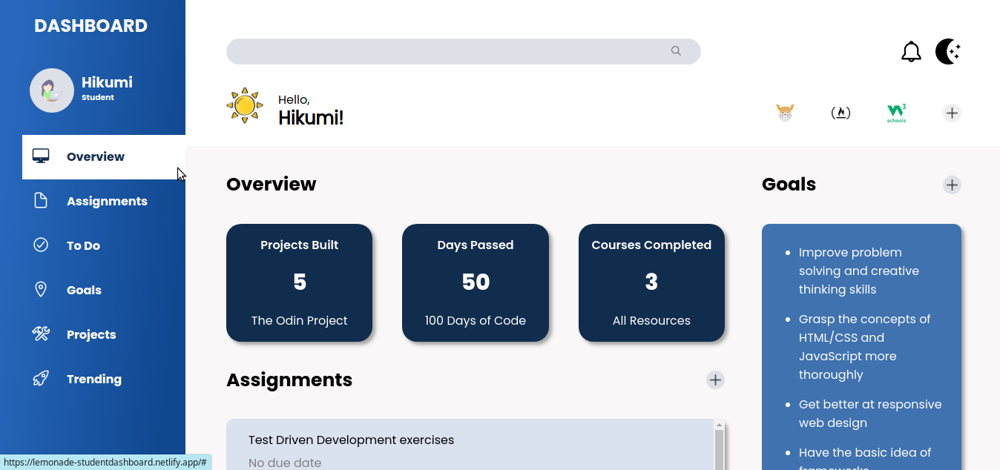
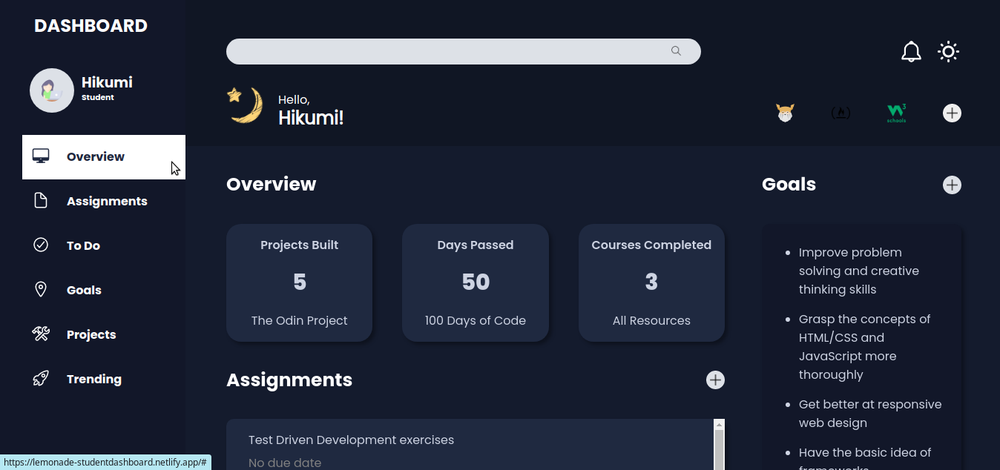

# Student Dashboard

[click here](https://lemonade-studentdashboard.netlify.app) for live preview!

#### Light Mode

#### Dark Mode (Updated!)

A dashboard that can help you to take a quick overview on your learning stuffs. I tried to put my knowledge of CSS Grid basic concepts into practice.

## Technologies I Used
* OS: Linux Ubuntu
* Editor: VS Code
* Source control provider: GitHub
* Tech stack:
    * HTML
    * CSS

## Outcomes
By creating this project, I learned:
* How to use HTML emmet to write the elements in more efficient way.
* How to use the some shorthand notations. 
* Create multiple grids using `repeat` function 
* Compare when to use `fr` and explicit size units.